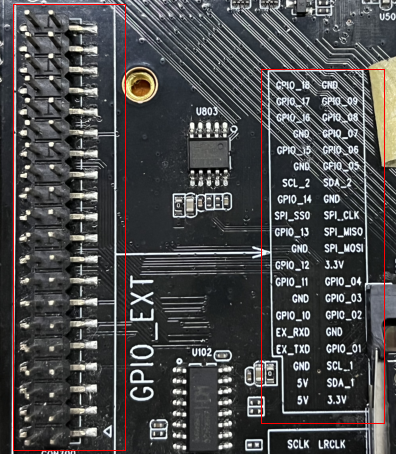

# GPIO控制

GPIO（General Purpose Input/Output Port），即通用输入输出端口，就是芯片的一些引脚。

作为输入端口时，我们可以通过它们读入引脚的状态--高电平或低电平。如：检测按键的按下与放开。

作为输出端口时，我们可以通过它们输出高电平或低电平来控制连接的外围设备。如：控制LED亮灭。

详细代码参考`sample/gpio`目录

图1 gpio 接口实物图


## 对外接口

```java
int UM_GPIO_Export(int s32GpioNum, int bExport);
int UM_GPIO_SetDirection(int s32GpioNum, int direction);
int UM_GPIO_SetValue(int s32GpioNum, int s32Value);
int UM_GPIO_IsExport(int s32GpioNum, int* ps32Value);
int UM_GPIO_GetDirection(int s32GpioNum, int* ps32Value);
int UM_GPIO_GetValue(int s32GpioNum, int* ps32Value);
```

## GPIO对应关系

```java
//gpios                                 raspberry pie
#define UM_GPIO_01              378     /* GPIO.7 */
#define UM_GPIO_02              379     /* GPIO.0 */
#define UM_GPIO_03              380     /* GPIO.2 */
#define UM_GPIO_04              381     /* GPIO.3 */
#define UM_GPIO_05              382     /* GPIO.21 */
#define UM_GPIO_06              383     /* GPIO.22 */
#define UM_GPIO_07              384     /* GPIO.23 */
#define UM_GPIO_08              385     /* GPIO.24 */
#define UM_GPIO_09              386     /* GPIO.25 */
#define UM_GPIO_10              387     /* GPIO.1 */
#define UM_GPIO_11              388     /* GPIO.4 */
#define UM_GPIO_12              389     /* GPIO.5 */
#define UM_GPIO_13              390     /* GPIO.6 */
#define UM_GPIO_14              391     /* GPIO.30 */
#define UM_GPIO_15              392     /* GPIO.26 */
#define UM_GPIO_16              393     /* GPIO.27 */
#define UM_GPIO_17              409     /* GPIO.28 */
#define UM_GPIO_18              408     /* GPIO.29 */

//spi cs
#define UM_GPIO_SPI_CS          486     /* SS0 */
```

## GPIO控制

在root用户模式下进行

```shell
$ su
```

本例子只是模拟一个gpio口（GPIO_09）来做设置out模式，且将其设置为高电平，有需要的话可以自己设置程序来控制gpio来操作

```shell
$ echo 386 > /sys/class/gpio/export
$ echo out > /sys/class/gpio/gpio386/direction
$ echo 1 > /sys/class/gpio/gpio386/value
$ echo 0 > /sys/class/gpio/gpio386/value
```
