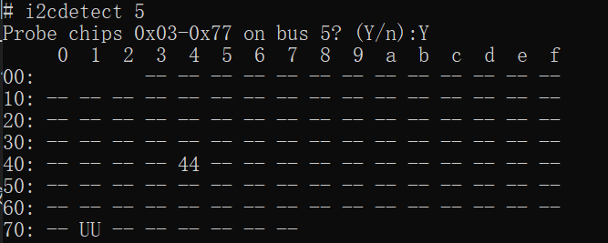
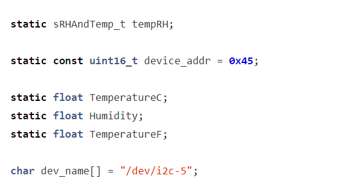
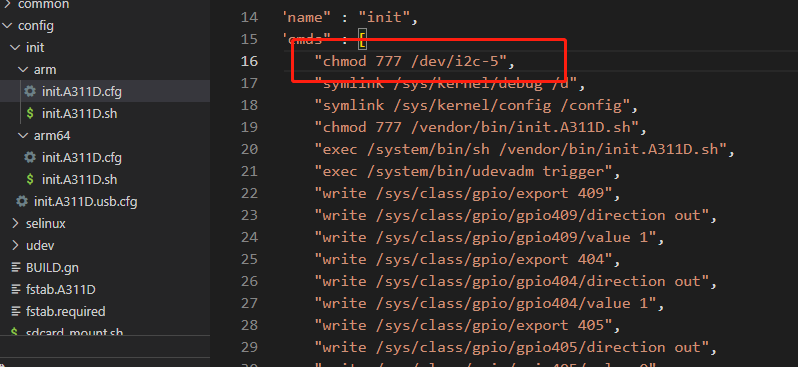
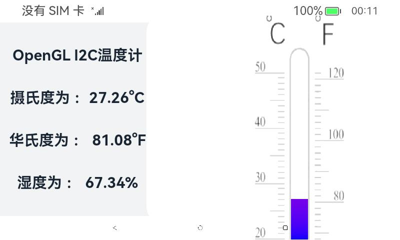

# i2c结合OpenGL绘制渐变温度计

## 实现介绍
根据i2c读取温度，使用OpenGL动态显示室温，中间的温度线具有由蓝变红的渐变效果；达到某个值后呈现红色

## 环境要求
- 本示例仅支持在标准系统上运行。

- SDK：Ohos_sdk_public 4.1.7.5 (API Version 11 )

## 实现步骤
1. 实现OpenGL ES的温度计图示
2. 实现I2C——NAPI
3. 关于eTS的编写
   
## 实现OpenGL ES的温度计图示
OpenGL学习参考链接：https://learnopengl-cn.readthedocs.io/zh/latest/01%20Getting%20started/01%20OpenGL/
### 实现步骤
本实现主要对外实现四个接口，包括
1. OpenGL ES初始化
2. 温度值更新
3. 温度计图示随温度值更新
4. 回收退出OpenGL ES资源
   
#### OpenGL ES初始化
```C
int32_t i2cOpengl::Init(void *window, int32_t width, int32_t height) {
    LOGI("Init window = %{public}p, w = %{public}d, h = %{public}d.", window, width, height);
    mEglWindow = reinterpret_cast<EGLNativeWindowType>(window);

    mEGLDisplay = eglGetDisplay(EGL_DEFAULT_DISPLAY);
    if (mEGLDisplay == EGL_NO_DISPLAY) {
        LOGE("unable to get EGL display.");
        return -1;
    }

    EGLint eglMajVers, eglMinVers;
    if (!eglInitialize(mEGLDisplay, &eglMajVers, &eglMinVers)) {
        mEGLDisplay = EGL_NO_DISPLAY;
        LOGE("unable to initialize display");
        return -1;
    }

    int version = 3;
    mEGLConfig = getConfig(version, mEGLDisplay);
    if (mEGLConfig == nullptr) {
        LOGE("GLContextInit config ERROR");
        return -1;
    }

    EGLint winAttribs[] = {EGL_GL_COLORSPACE_KHR, EGL_GL_COLORSPACE_SRGB_KHR, EGL_NONE};
    if (mEglWindow) {
        mEGLSurface = eglCreateWindowSurface(mEGLDisplay, mEGLConfig, mEglWindow, winAttribs);
        if (mEGLSurface == nullptr) {
            LOGE("eglCreateContext eglSurface is null");
            return -1;
        }
    }

    /* Create EGLContext from */
    int attrib3_list[] = {
        EGL_CONTEXT_CLIENT_VERSION, 3,
        EGL_NONE};

    mEGLContext = eglCreateContext(mEGLDisplay, mEGLConfig, mSharedEGLContext, attrib3_list);
    if (!eglMakeCurrent(mEGLDisplay, mEGLSurface, mEGLSurface, mEGLContext)) {
        LOGE("eglMakeCurrent error = %{public}d", eglGetError());
    }
    CreateProgram();
    LOGI("Init success.");

    return 0;
}
```

初始化通过EGL接口实现，其中,`CreateProgram()`则为封装创建着色器程序,本实现使用了两类着色器程序,一类绑定温度值刻度显示,另一类绑定温度计纹理图片,初始化大致流程如下：


#### 更新温度值
接受来自ETS端的温度值，并用此温度值改变OpenGLES图示的刻度值
```C
void i2cTemp::SetTemp(double tempe) {
    temp = (float)tempe;
}
```
#### 温度计图示随温度值更新
实现如下:
```C
void i2cOpengl::Update(void) {
    glClearColor(1.0f, 1.0, 1.0f, 1.0f);
    glClear(GL_COLOR_BUFFER_BIT);
    temperatureLocation = glGetUniformLocation(shaderProgram, "currentTemperature");
    a_positionLocation = glGetAttribLocation(shaderProgram, "a_position");
    float currentTemperature = generateNormalizedTemperature(temp);
    SetAndEnable();
    LoadTexture();

    glEnable(GL_DEPTH_TEST);
    glUseProgram(shaderProgram);
    glUniform1f(temperatureLocation, currentTemperature);

    glBindVertexArray(vao[0]);
    glDrawArrays(GL_TRIANGLE_FAN, 0, 4);
    if ((err = glGetError()) != GL_NO_ERROR) {
        LOGE("%{public}u  %{public}d", err, __LINE__);
    } else {
        LOGI("success to draw %{public}u", err);
    }

    glUseProgram(shaderProgram1);
    LOGI("Using shaderProgram1");
    glBindVertexArray(vao[1]);
    glActiveTexture(GL_TEXTURE0);
    glBindTexture(GL_TEXTURE_2D, texture);
    glUniform1i(glGetUniformLocation(shaderProgram1, "texture1"), 0);

    glDrawArrays(GL_TRIANGLE_FAN, 0, 4);
    if ((err = glGetError()) != GL_NO_ERROR) {
        LOGE("%{public}u  %{public}d", err, __LINE__);
    }
    LOGE("Finish Drawing");
    eglSwapBuffers(mEGLDisplay, mEGLSurface);
}
```
其中, `SetAndEnable()`函数链接相应VBO所需数组以及给着色器相应参数赋值并使能,`LoadTexture()`函数则设置了相应纹理属性以及载入纹理.然后通过两个着色器程序的切换画图,再进行交换缓冲.

- 本纹理实现需要单头文件图像加载库stb_image.h,导库地址如下:
https://github.com/nothings/stb/blob/master/stb_image.h

- 另外,由于OpenGL的调用关系,纹理图片须得放在板载上且为需要为绝对路径,本实现按函数`LoadTexture()`的实现情况而言:
  


本实现的温度计图片放在`entry/src/main/resourses/base/media`，开发者须将图片放置于有效路径并进行读取路径的更改
完整的目录须包含：


### 实现I2C温湿度的读取
本实现的I2C部分使用`vendor\unionman\unionpi_tiger\sample\napi\napisubsys\i2cnapipart\i2cnapidemo`里提供的I2C NAPI接口

参考:
https://gitee.com/openharmony/vendor_unionman/tree/master/unionpi_tiger/sample/napi/napisubsys/i2cnapipart/i2cnapidemo

另外:通过HDC工具查询I2C设备挂载在`/dev/i2c-5 `总线上，且设备地址为0x44;


如若与程序:



不一致,应适当修改程序至相应正确总线的相应设备地址

正确编译成动态库后需将其送至板载`/system/lib/module`目录下
```shell
hdc_std shell mount / -o remount,rw
hdc_std file send ./libi2cnapidemo.z.so /system/lib/module
```
另外:由于APP要调用I2C设备需要权限,则以下提供两种方法:
1.  修改系统权限，使APP能够访问i2c驱动
    修改`device\board\unionman\unionpi_tiger\config\init\arm\init.A311D.cfg `文件，在cmds中添加
    ```json
    "chmod 777 /dev/i2c-5",
    ```
    
    更改后再烧录以及导库,这样,每次在开发板开机时,则会自动打开权限
2. 每次开发板开机都手动更改权限
    ```shell
    chmod 777 /dev/i2c-5
    ```


至此,则完成了I2C库的导入.

### 关于eTS的编写
```TS 
 async aboutToAppear() {
    Logger.info('aboutToAppear');
    let resourceManager = getContext(this).resourceManager;
    this.tempString = await resourceManager.getStringValue($r('app.string.mode_label').id);
    i2cnapidemo.SoftReset();
    i2cnapidemo.ModeSet(1,1);
  }

  getValue() {
    i2cnapidemo.ReadData();
    this.tempC = i2cnapidemo.ReadTemperatureC();
    this.tempF = i2cnapidemo.ReadTemperatureF();
    this.Hum = i2cnapidemo.ReadHumidity();
  }

  startWork() {
    this.intervalID = setInterval(() => {
      this.getValue();
    }, 500)
  }

  Update() {
    this.updateintervalID = setInterval(() => {
      i2cOpengl.updateTemp(this.tempC);
    }, 500)
  }
```
本实现主要通过两个定时器,`startWork()`主要用于更新I2C读取的温湿度值,其中用到的接口来源于以上导入的I2C动态库,`Update()`则主要用于更新OpenGL的图示

本OpenGLES图示主要显示在XComponent组件上,组件提供`onLoad()`与`onDestroy()`接口用于回调,本实现在`onLoad()`时调用`Update()`定时器进行更新图示,其中的`UpdateTemp()` NAPI接口主要调用`SetTemp(temp1)`更新数据以及调用`Update()`更新图示画面:
```C++
napi_value AppNapi::UpdateTemp(napi_env env, napi_callback_info info)
{
    LOGE("Update");
    size_t argc = 1;
    napi_value args[1] = {nullptr};

    napi_get_cb_info(env, info, &argc, args, nullptr, nullptr);

    napi_valuetype valuetype0;
    napi_typeof(env, args[0], &valuetype0);
    
    double temp1;
    napi_get_value_double(env, args[0], &temp1);

    i2cOpengl_->SetTemp(temp1);
    
    i2cOpengl_->Update();
    i2cOpengl_->Update();
    
    napi_value ret;
    napi_create_double(env, temp1, &ret);

    return ret;
}
```

## 实现效果


## 注意事项

clone下来的项目文件中不包含开源库（stb-image），需到官方仓库下载.

[stb-image]: https://gitee.com/openharmony-sig/stb-image

