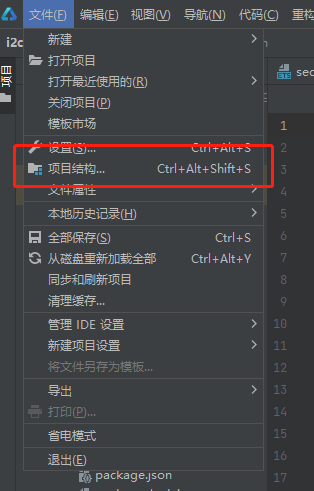
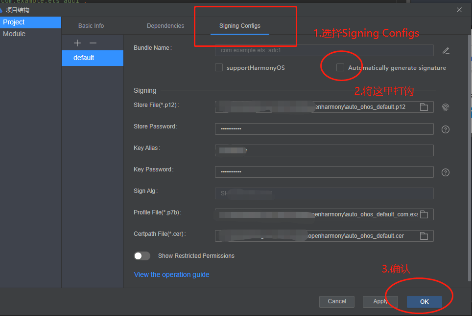

# 用APP显示i2c读取的温湿度传感器数据

### 利用NAPI实现软件与硬件的交互

NAPI在 unionman\unionpi_Tiger\sample\app\gpioled_app\README.md 中有详细介绍及说明

**PS：使用该例程前请先阅读`unionman\unionpi_Tiger\sample\hardware\i2c`中的README.md**

### 例程使用方法

#### 一.添加子系统

打开`build/subsystem_config.json`文件，**添加下列语句**

```json
  "napisubsys":{
    "path":"vendor/unionman/unionpi_tiger/sample/napi/napisubsys",
    "name":"napisubsys"
  },
```

#### 二.添加组件

打开`unionpi_tiger/sample/napi/napisubsys/ohos.build`文件，在`"parts":`中添加下列语句

```json
        "i2cnapipart": {
            "variants": [
                "phone"
            ],
            "module_list": [
                "//vendor/unionman/unionpi_tiger/sample/napi/napisubsys/i2cnapipart/i2cnapidemo:i2cnapidemo"
            ]
        }
```

#### 三.添加产品定义

打开`vendor/unionman/unionpi_tiger/config.json`文件，在`"subsystems":`中添加下列语句

```json
    {
      "subsystem": "napisubsys",
      "components": [
        {
          "component": "i2cnapipart",
          "features": []
        }
      ]
    },
```

#### 四.编译烧录

参考:https://gitee.com/openharmony/device_board_unionman/blob/master/unionpi_tiger/README_zh.md#%E7%BC%96%E8%AF%91%E4%B8%8E%E8%B0%83%E8%AF%95

#### 五.使用教程

###### 1.修改系统权限，使APP能够访问i2c驱动（暂未其他解决权限方法，如有解决方法欢迎提出）

修改`device\board\unionman\unionpi_tiger\config\init\arm\init.A311D.cfg `文件，在cmds中添加

```
"chmod 777 /dev/i2c-5",
```


###### 2.将传感器与开发板相连

​			***SCL_1 ——SCL***

​			***SDA_1——SDA***

​				***5V  ——VCC***

​     		  ***GND——GND***

###### 3.app安装

(1).用DevEco Studio打开位于 `unionman\unionpi_tiger\sample_api11\app` 的 `i2c_app` 文件夹

(2).设置应用签名





(3).将位于`unionman\unionpi_tiger\sample\napi\napisubsys`中的`@ohos.i2cnapidemo.d.ts`复制并放在`X:\Users\XXXXX\AppData\Local\OpenHarmony\Sdk\ets\3.1.6.6\api`文件夹内

*此路径是由SDK安装目录决定，如不清楚自己路径可打开DevEco Studio—工具—SDK管理—外观和行为—OpenHarmony SDK中查看*

(4).安装app至开发板

在DevEco Studio右上角点击图片上所示按钮

#### 六.展示

