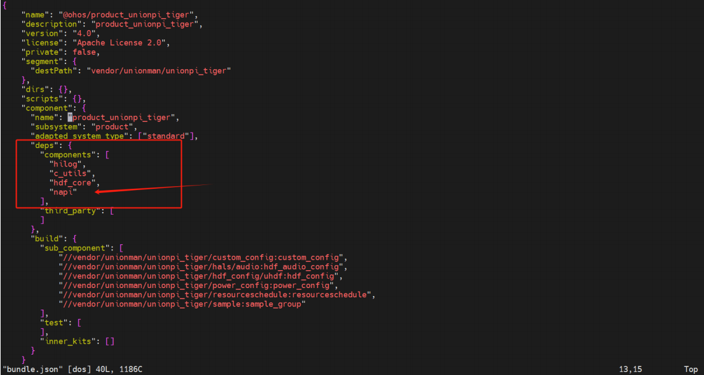
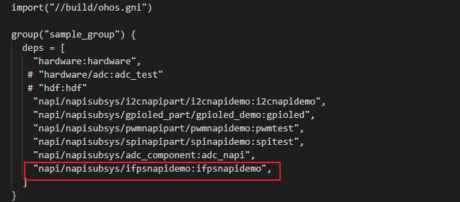

### IFPS

### **作品简介**

基于OpenHarmony的智能消防系统，实现对温湿度的监测，可燃气体及火焰的检测，对应设置三级警报，使用舵机模拟自动灭火设备的开关，蜂鸣器实现报警功能。

### **开发环境简介**

1、搭载OpenHarmony-4.0-Beat5版本的Unionpi Tiger开发板

2、DevEco Studio 4.0.0.600

3、温湿度模块SHT3x-DIS

4、烟雾传感器MQ-2

5、火焰传感器FC-01

6、MG996R舵机

7、无源蜂鸣器

### 温湿度传感器数据采集

通过IIC协议进行数据的采集

### 烟雾传感器数据采集

通过ADC通道1采集ADC值，使用转换公式转换获取烟雾浓度，例程中仅使用简单的线性转换

### 火焰传感器数据采集

通过ADC通道2采集ADC值，通过转换获取到的电压值判断是否检测到火焰

### 蜂鸣器控制

使用PWM控制蜂鸣器，以发出不同频率的声音，对应不同的警报等级

### 舵机控制

使用PWM控制舵机，通过调整占空比以控制舵机转动角度

### NAPI

全称 Native API，是OpenHarmony系统中的一套原生模块拓展开发框架，基于N-API开发，为开发者提供了JS与C/C++不同语言模块之间的相互访问，交互的能力。它可以用于规范化封装IO、OS底层等，并可以提供相应的JS接口供开发者调用。

#### 编写子系统组件

在vendor/unionman/unionpi_tiger/sample/napi/napisubsys目录下新建ifpsnapidemo文件夹。

##### 文件目录


##### 编写ifpsnapidemo.cpp文件

##### 编写GN构建脚本

ifpsnapidemo/BUILD.gn

```json

import("//build/ohos.gni")

config("warns") {
  cflags = [ "-Werror" ]
}

ohos_shared_library("ifpsnapidemo") {
  include_dirs = [
    "//foundation/ace/napi/interfaces/kits",
    "//commonlibrary/c_utils/base/include",
    "//base/hiviewdfx/hilog/interfaces/native/innerkits/include",
  ]

  sources = [
    "i2cinterface.c",
    "ifpsnapidemo.cpp",
     "sample_client.c",
    "um_adc.c",
     "um_pwm.c",
  ]
 
  configs = [ ":warns" ]
  
  external_deps = [
    "c_utils:utils",
    "hilog:libhilog",
    "napi:ace_napi",
  ]

  part_name = "product_unionpi_tiger"
}

ohos_executable("sample_server") {
  output_name = "sample_server_executable" 
  sources = [ "sample_server.c" ]
  include_dirs = [ "//base/hiviewdfx/hilog/interfaces/native/innerkits/include" ]
  configs = [ ":warns" ]
  external_deps = [
    "c_utils:utils",
    "hilog:libhilog",
  ]
  install_images = [ "system" ]
}
```

##### 修改配置

ohos4.0release/vendor/unionman/unionpi_tiger/bundle.json



ohos4.0release/vendor/unionman/unionpi_tiger/sample/BUILD.gn



#### 编写TS接口定义文件

编写好NAPI代码之后，需要编写TS接口定义文件(.d.ts),这样开发OpenHarmony应用时，编译器才知道模块定义了哪些函数以及对应的返回值，参数列表等。

@ohos.ifpsnapidemo.d.ts

```ts
declare namespace ifpsnapidemo {

// 传感器软重启
function Sht3xSoftReset(): number;

/**
 * 设置传感器测量模式
 * @param mps 取值为[0,3] 对应mps=0.5、1、2、4、10Hz
 * @param repeatability 取值为[0,2] 对应低刷新率、中刷新率、高刷新率
 */
function Sht3xModeSet(mps: number, repeatability: number): number;

// 读取温湿度数据
function Sht3xReadData(): number;
// 使用下列三个接口时必须先调用ReadData
function Sht3xReadTemperatureC(): number;
function Sht3xReadHumidity(): number;
function Sht3xReadTemperatureF(): number;

function Mq2GetAdcValue(): number;
function Mq2GetPermission(): number;

function FlameSensorGetAdcValue(): number;
function FlameSensorGetPermission(): number;

/**
* 设置pwm的开关状态
* @param pwmPex pwm引脚
* @param pwmAngle pwm角度
*/
function SetPwmStatus(pwmPex: number, pwmAngle: number): Promise<number>;
}

export default ifpsnapidemo;
```

### 构建

进入OpenHarmony源代码的根目录，执行编译

```shell
./build.sh --product-name unionpi_tiger –ccache
```

如果开发板已经烧录了同版本的OpenHarmony操作系统,可以在out/unionpi_tiger/[子系统名]/[组件名]文件夹中找到组件对应的动态库,然后使用hdc工具发送到开发板的/system/lib/module目录中即可，省去了烧录所花的时间

```shell
hdc_std file send libxxx.z.so /system/lib/module
```

在发送时，可能出现以下错误

[Fail]Error opening file: read-only file system, path:/system/lib/module/libxxx.z.so

这是因为system分区被开机挂载为只读分区，解决方案是重新挂载system分区为可读写分区

```shell
hdc_std shell mount / -o rw,remount
```

然后再重新发送动态库至开发板即可

### 编译用户程序

1、往对应版本的SDK中添加自定义的ifpsnapidemo.d.ts 文件

2、使用DevEco Studio打开项目文件夹IFPS-APP

3、添加自动签名

4、执行编译

### 演示效果

| 首页                                                         | 状态                                                         | 日志                                                         |
| ------------------------------------------------------------ | ------------------------------------------------------------ | ------------------------------------------------------------ |
|  |  |  |

